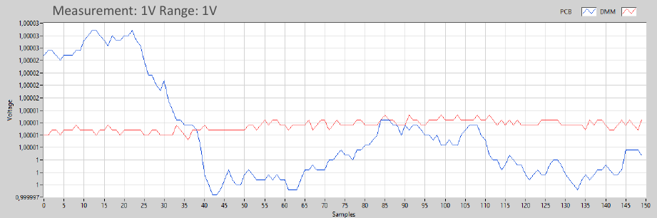
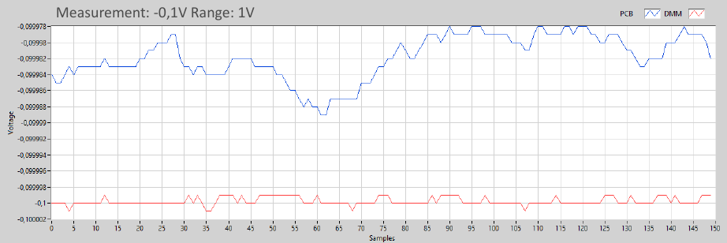
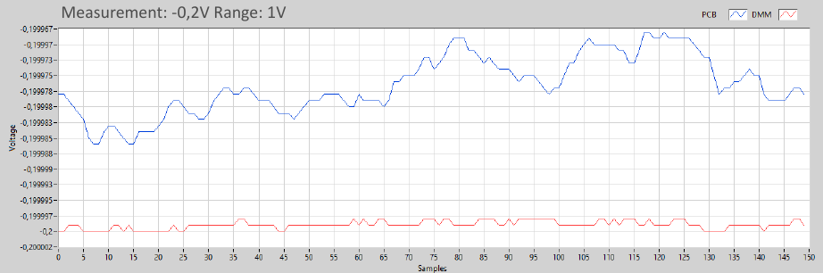

<h1> ADC_Test </h1>
<blockquote>
    PCB design to test the multislope ADC concept created by Jaromir Sukuba (https://github.com/jaromir-sukuba).
</blockquote>

<h2> Design </h2>

The project features a 4-layer PCB designed in the Eurocard 3U format. The PCB operates on a 24V DC power supply. Communication is handled via Ethernet, utilizing a RAW TCP protocol with SCPI command format.

</img>

Key components include:
<ul>
    <li> <b>MCU</b>: STM32F765ZGT running FreeRTOS, developed with STM32CubeIDE.</li>
    <li> <b>FPGA</b>: ICE40HX4K-TQ144, with logic synthesis performed using IceStorm, and programmed in Verilog.</li>
    <li> <b>ADC</b> : Max voltage +/- 12V DC. 
            NPLC (Number of Power Line Cycles): 1, 2, 5,10 and 100.</li>
</ul>
The analog front end supports three bipolar ranges: 1V, 10V, and 100V DC.

</img>

<h2> Test </h2>

The PCB 3 measurement ranges where calibrated with a voltage calibrator (Inmel 7000). 

The calibrator voltage specification for voltage ranges are as follows: 

<table align="center">
    <tr>
        <th>Range</th>
        <th>Range setting</th>
        <th>Accuracy</th>
    </tr>
    <tr>
        <td>2V</td>
        <td>+/-2.1V</td>
        <td>+/-(30ppm S+ 5ppm R)</td>
    </tr>
    <tr>
        <td>20V</td>
        <td>+/-21V</td>
        <td>+/-(30ppm S + 5ppm R)</td>
    </tr>
    <tr>
        <td>200V</td>
        <td>+/-210V</td>
        <td>+/-(30ppm S + 5ppm R)</td>
    </tr>
</table>

S - set value, R - range rated value

<h3> DMM with ADC comparison</h3>

The Inmel 700 calibrator was used as the voltage source. DMM (34411A) results are used as reference values. DMM and ADC are setup for 100 NPLC, auto-zero once. Average from 150 samples.

<b>Positive voltages</b>

<table align="center">
    <tr>
        <th>Range (V)</th>
        <th>Value (V)</th>
        <th>DMM (V)</th>
        <th>ADC (V)</th>
        <th>Error (%)</th>
    </tr>
    <tr>
        <td>1</td>
        <td>0.1</td>
        <td>0.100001</td>
        <td>0.100008</td>
        <td>0.0070</td>
    </tr>
    <tr>
        <td>1</td>
        <td>0.2</td>
        <td>0.200005</td>
        <td>0.200013</td>
        <td>0.0040</td>
    </tr>
    <tr>
        <td>1</td>
        <td>0.5</td>
        <td>0.500009</td>
        <td>0.500015</td>
        <td>0.0012</td>
    </tr>
    <tr>
        <td>1</td>
        <td>1</td>
        <td>1.000012</td>
        <td>1.000009</td>
        <td>0.0003</td>
    </tr>
    <tr>
        <td>10</td>
        <td>1</td>
        <td>1.00000</td>
        <td>1.00003</td>
        <td>0.0030</td>
    </tr>
    <tr>
        <td>10</td>
        <td>2</td>
        <td>2.00005</td>
        <td>2.00004</td>
        <td>0.0005</td>
    </tr>
    <tr>
        <td>10</td>
        <td>5</td>
        <td>5.00021</td>
        <td>5.00018</td>
        <td>0.0006</td>
    </tr>
    <tr>
        <td>10</td>
        <td>10</td>
        <td>10.0005</td>
        <td>10.0005</td>
        <td>0.0000</td>
    </tr>
    <tr>
        <td>100</td>
        <td>10</td>
        <td>10.0005</td>
        <td>9.99996</td>
        <td>0.0054</td>
    </tr>
    <tr>
        <td>100</td>
        <td>20</td>
        <td>20.0012</td>
        <td>20.0005</td>
        <td>0.0035</td>
    </tr>
    <tr>
        <td>100</td>
        <td>50</td>
        <td>50.0009</td>
        <td>50.0003</td>
        <td>0.0012</td>
    </tr>
    <tr>
        <td>100</td>
        <td>100</td>
        <td>100.0028</td>
        <td>100.0027</td>
        <td>0.0001</td>
    </tr>
</table>

<b>Negative voltages</b>

<table align="center">
    <tr>
        <th>Range (V)</th>
        <th>Value (V)</th>
        <th>DMM (V)</th>
        <th>ADC (V)</th>
        <th>Error (%)</th>
    </tr>
    <tr>
        <td>1</td>
        <td>-0.1</td>
        <td>-0.0999999</td>
        <td>-0.0999819</td>
        <td>0.0018</td>
    </tr>
    <tr>
        <td>1</td>
        <td>-0.2</td>
        <td>-0.199999</td>
        <td>-0.199976</td>
        <td>0.0115</td>
    </tr>
    <tr>
        <td>1</td>
        <td>-0.5</td>
        <td>-0.500002</td>
        <td>-0.499979</td>
        <td>0.0046</td>
    </tr>
    <tr>
        <td>1</td>
        <td>-1</td>
        <td>-1.00001</td>
        <td>-0.999967</td>
        <td>0.0043</td>
    </tr>
    <tr>
        <td>10</td>
        <td>-1</td>
        <td>-1.000020</td>
        <td>-0.999981</td>
        <td>0.0039</td>
    </tr>
    <tr>
        <td>10</td>
        <td>-2</td>
        <td>-2.00002</td>
        <td>-1.99998</td>
        <td>0.0020</td>
    </tr>
    <tr>
        <td>10</td>
        <td>-5</td>
        <td>-5.00014</td>
        <td>-5.00008</td>
        <td>0.0012</td>
    </tr>
    <tr>
        <td>10</td>
        <td>-10</td>
        <td>-10.0004</td>
        <td>-10.0003</td>
        <td>0.0010</td>
    </tr>
    <tr>
        <td>100</td>
        <td>-10</td>
        <td>-10.0004</td>
        <td>-10.0003</td>
        <td>0.0010</td>
    </tr>
    <tr>
        <td>100</td>
        <td>-20</td>
        <td>-20.0011</td>
        <td>-20.0009</td>
        <td>0.0010</td>
    </tr>
    <tr>
        <td>100</td>
        <td>-50</td>
        <td>-50.0007</td>
        <td>-49.9997</td>
        <td>0.0020</td>
    </tr>
    <tr>
        <td>100</td>
        <td>-100</td>
        <td>-100.003</td>
        <td>-100.001</td>
        <td>0.0020</td>
    </tr>
</table>

<h3> Measurements graphs</h3>

<b>NOTE</b> : DMM and PCB sampling was not synchronized.

<b>Positive voltage samples</b>

</img>

</img>

</img>

</img>

</img>

</img>

</img>

</img>

</img>

</img>

</img>

</img>

<b>Negative voltage samples</b>

</img>

</img>

</img>

</img>

</img>

</img>

</img>

</img>

</img>

</img>

</img>

</img>

<h2>Links</h2>

<ul>
    <li><a href="https://en.wikipedia.org/wiki/Integrating_ADC" target="_blank">Integraring ADC</a></li>
        <li><a href="https://patentimages.storage.googleapis.com/1c/fb/ba/970d5c758ec96f/US5321403.pdf" target="_blank">Multi-slope ADC patent</a></li>
        <li><a href="https://github.com/jaromir-sukuba/vm_mini" target="_blank">vm_mini</a></li>
        <li><a href="https://www.eevblog.com/forum/metrology/diy-6-5-digit-voltmeter/" target="_blank">DIY 6.5 digit voltmeter</a></li>
</ul>
